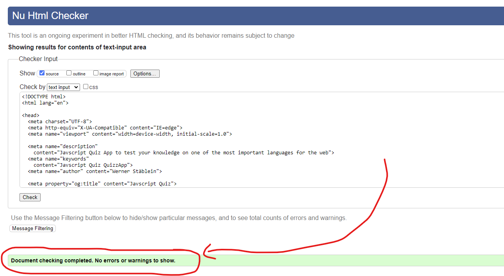
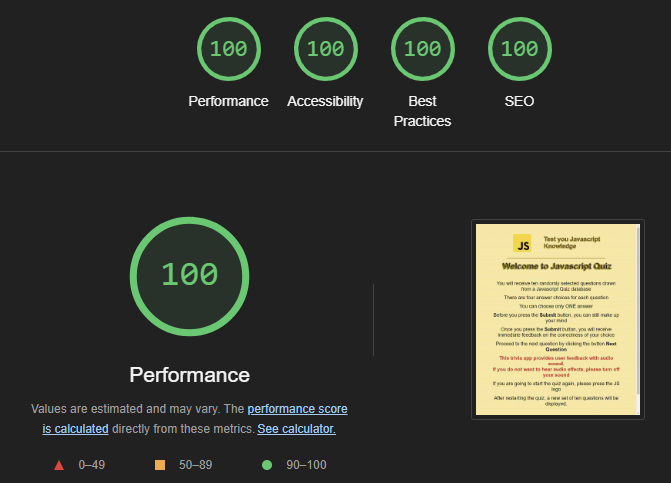

# Javscript Quiz App - Javascript Project: Milestone 2

Javscript Quiz is an interactive quiz for users to answer questions on their knowledge of Javascript. 
Questions created are stored in a separate Array. 

The Quiz randomly picks 10 of those questions to be answered and provides the user the choice among four different answers of which only one is correct.

The color palette is harmoniously coordinated with the logo, allowing for a coherent and calm image with its bright and warm colors.

The target audience for this JavaScript quiz includes individuals starting their programming careers, students from the Code Institute looking to test their JavaScript knowledge, and people interested in web development. This quiz helps users prepare for technical exams or coding interviews, verify their JavaScript skills, and reinforce basic programming concepts.

## Live project

The live project can be viewed here under this link **[FinalProject](https://werner-staeblein.github.io/Project-2-modified-resubmit/)**

# User Experience (UX)

## User stories

### As a first time user

- As a first-time website visitor, I want to receive instructions on what the quiz is about
- I want to easily and intuitively navigate through the quiz
- I want to know where to start the quiz indicated by a 'Start JS Quiz' button
- I want to know the number of questions already answered (progress indication/bar) during the trivia round
- I want to receive immediate feedback whether I have clicked an answer or not yet clicked and answer
- I want to have immediate feedback in the form of color, audio input if I want to, and feedback on whether I have correctly clicked an answer
- I want to see the progress of correct and incorrect answers clicked during my trivia round
- I want to see the points achieved at the end of the trivia round in addition to the progress tracking of correct and incorrect answers during the trivia round
- I want to restart the quiz either while I am taking the quiz or at the end of the quiz (user control)
- I want to see different questions each time that I am running the quiz for the app to be more entertaining
- I want to see all trivia questions including their respective answers at the end of a round. This is in addition to the immediate feedback provided during the trivia round where user feedback is already provided when an answer is chosen

### As a returning user

- I want to answer different questions so that I do not see the same questions again
- I want to play the game as many times that I would want to

# Structure

The website provides instructions for the quiz on the opening page and allows a user to press the button "Start JS Quiz" for the quiz.

Once the quiz is started with the "Start JS Quiz" button, the user receives a sequence of ten questions related to Javascript. 

The ten questions are randomly drawn from a catalog of quiz questions to ensure each quiz round provides a different set of questions.

During any given trivia round, the user receives immediate feedback on five dimensions:

(i) First, a change of color of the radio button for the answer chosen by the user.

(ii) Second, highlight the correct answer in green and, if the user clicks a wrong answer, the user is shown in red color that the chosen answer was wrong while the correct answer is shown in green color.

(iii) Third, the user receives continuous feedback on the number of correct answers already made versus the incorrect answers made during the quiz round.

(iv) Fourth, the user is provided immediate feedback by changing the "Submit" button "NextQuestion" button once an answer is submitted. The change of name of the button happens simultaneously with the immediate feedback provided with green/red colors for the answer provided by the user.

(v) Fifth, upon user choice, the user can see all answers clicked during the trivia round split by correct and wrong answers provided by the user supplemented with the respective correct answer to each quiz question.

After opening a quiz with the 'Start JS Quiz' button, the user can decide to restart the quiz by clicking on the logo on the top left of the website. This will take the user back to the start of the quiz. When the user decides to click the JS logo to start a new quiz round, the scoring of results starts again at zero and no interim points achieved for discontinued quiz rounds are stored.

In addition to the functionality of the JS logo, the user can restart a new quiz round at the end of the quiz by clicking the "Retry" button.

### Opening Page | Instructions page

The opening page provides a logo, a clear headline about the page  "Javascript Quiz", and instructions for the user to play the quiz combined with the 'Start JS Quiz' button to start the knowledge game.

The user is informed in red colored text that the app provides feedback with audio sound and that any such sound effects can be suppressed by turning off the sound of the device.

A tooltip becomes visible once the user hovers over the Javascript logo.

### Trivia Page

Reminder: Trvia page has changed / new image needed in final README

The trivia page continues to show the logo and title of the website. Once the start button was clicked, the instructions page is no longer visible and is now replaced with the trivia question box. 

The radio buttons for the questions provide options for the user to click one possible answer. Radio buttons are custom-styled to support the overall design and appearance of the question section.

Once the user submits a choice on the radio button, the next quiz question automatically appears
(automatic user feedback).

 
### Results Page

The results page is an extension of the trivia page.

After finishing 10 quiz questions, the user receives the points achieved in the quiz round with optionality to view correct answers and questions answered incorrectly. For both cases, the user receives the correct answer even if answered correctly as the user may have guessed an answer from the four answer options.

Reminder: Trvia page has changed / new image needed in final README

# Design

The design is based on the key colors in the Javascript logo. Using the colors included in the JS logo. A color palette was generated with coolors. This ensures a consistent feel for the user.

User activity such as click of buttons is supported by box shadows to make the overall design more appealing.

A linear gradient using the color scheme was used for the background of the trivia. Different linear gradients were used for the quiz box to ensure an appealing color design aligned with the base color scheme of the Javascript logo.

### Color Palette

The color palette was created with: **[color-hex](https://www.color-hex.com)**

### Typography

Standard fonts available were used with Arial and Helvetica for reasons of legibility. As a backup to these two font types/font family, a sans-serif backup font was used.

### Images

The Javascript icon was downloaded from **[Icons8.com](https://icons8.com/icons/set/javascript)**

# Features

### The logo

The logo is shown on all pages of the website. The logo likewise is a hyperlink to restart the trivia if the user wants to restart a new round of questions while already having started on a round of questions. 

The logo can likewise be clicked by the user to play another trivia round (user control) once a trivia round has been completed. 

If a trivia round is NOT started, the functionality of "restarting" a quiz round is NOT working simply because no trivia round has been started. Because no trivia round was started, the functionality of "Retry" does not work on the opening screen where the trivia is explained. This behavior of the clickable logo is as an intended feature.

On hover, a tooltip is displayed with information that the quiz can be restarted with a click on the logo.

### Start Page quiz instructions page

On the start page, the instructions for the quiz are provided. The user is informed that questions are randomly drawn from a set of questions.
The button named 'Start JS Quiz' is prominently placed so that a user can easily navigate to the start of the quiz.

The user is likewise informed prominently with red-colored text that the trivia app provides user feedback with audio sound. The user is free to turn off sound effects on the device used for the application.

### Quiz Questions

The trivia has 10 questions for the user to answer. While answering the questions, the user is provided **immediate feedback** with a progress indicator on the number of questions already answered.

Every question has four radio buttons to choose from. A user can change the radio button/answer as long as the submit button is not clicked. Once a radio button is clicked, **immediate feedback** to the user is as follows:

- the color of the radio button clicked changes,
- the number of questions already answered (count) increases by one,
- the user is shown the correct answer in green if answered correctly,
- the user is shown the correct answer in green and, if the wrong answer was chosen, the incorrectly clicked answer is in red color,
- the count of "Wrong Answers" or "Correct Answers" both using the same red/green coloring to display wrong/correct answers increases by one depending on the correctness of the last answer,
- the button 'Submit' changes to 'Next Question' indicating to the user to proceed to the next question

Describe the user feedback at the end of the quiz for displayAnswer()

### Visual Effects

- Change in background color on hover on the start button,
  
- Radio buttons to select answers were customized in CSS to support the overall appeal and coherent color experience while playing the quiz but likewise to provide immediate feedback on which answer the user clicked,

- Correct answers are shown in green color to the user. Wrong answers are shown in red color to the user while the correct answer to the question is shown in green. The latter supports immediate feedback to the user while the user is playing the game,

- The count of "Wrong Answers" and "Correct Answers" likewise uses the intuitive green/red coloring as a visual effect.

### Customized radio buttons for answer choices

Radio buttons to select answers were customized in CSS to support overall appeal and coherent color experience while playing
the quiz.

### User feedback on scores achieved

More explanations on IMMEDIATE user feedback provided during the trivia round such as Green when answered correctly and NO red color for wrong answer as answer was correct in the first place or GREEN and RED with Green for the right answer and RED for the wrong answer clicked / the radio button clicked by the user remains visible with the same color, no matter whether the answer clicked was correct or wrong

### Results Page

The results page is the last question plus information about the result achieved.
The final score out of 10 is displayed.

Depending on the score achieved, a message is shown.

- if the number of points achieved is equal to 10, a user is shown "Seems you are a Javascript wizard"
- if the number of points is higher than or equal to 8 but less than 10, a user is shown "Nearing the gold medal"
- if number of points is higher than or equal to 6 but less than 8, a user is shown "Good knowledge but more is yet to come"
- if the number of points is lower than 6, a user is shown "Try again to improve your score"

The results page also provides an option for the user to start a new quiz. This will take the user to the beginning of the website with the trivia starting at the first question.

### Show Answer
Once the ShowAnswer button on the results page is clicked, the user is shown the incorrect answers
including the underlying question, the user's answer in the quiz, and the correct answer to the 
question. 

As questions are drawn randomly from a questions array, the user can not face the same question again in
the next quiz round but the user can learn from the questions answered incorrectly.

### Possible Future Features

- a timer feature could be added to so that the amount of time for each question or the entire set of ten questions for the user is limited,

- a highscore feature could be added for users repeating the quiz multiple times,

- an additional feature of more explanatory notes for each answer could be provided in the showSolution section so that a user is not only shown the correct answer but likewise some additional explanation as to why the answer is the correct one,

- Enlarge the underlying selection of quiz questions beyond 40 and, possibly, classify questions such as "starter/intermediate/advanced",

- allow the user to pre-select knowledge status and take quiz questions based on the categorical organization of quiz questions into buckets of "starter/intermediate/advanced".

# Technologies

- Languages: HTML, CSS, JavaScript

- **[Favicon.cc](https://www.favicon.cc/)** - Used to prepare the website's favicon

- **[GitHub](https://www.github.com)** - GitHub for storage of files

- **[GitPod](https://www.gitpod.io/)** - GitPod as IDE for development of this site

- **[Git](https://git-scm.com)** - Version control system Git

- **[W3C HTML Markup Validator](https://validator.w3.org/)** - W3C HTML markup validator for validation of HTML code

- **[W3C Jigsaw CSS Validator](https://jigsaw.w3.org/css-validator/)** - W3C Jigsaw CSS validator for validation of CSS code

- **[Javascript Validator Beautfiytools](https://beautifytools.com/javascript-validator.php)** - to validate the Javscript code.

- **[Javascript Validator JSLint](https://www.jslint.com/)** - to validate the Javscript code.

- **[Visual Code Studios](https://code.visualstudio.com/)** - IDE used to draft the webiste and make working progress remarks in the README.md including placehoders to check for final polishing

- **[Google Chrome Dev Tools](https://developers.google.com/web/tools/chrome-devtools)**- to check responsiveness of page, debug code, and important lighthouse checks for performance, accessibility, best practices, SEO

- **[Techsini](https://techsini.com/multi-mockup/index.php)** - to generate multi-device image with different screen-sizes and devices possibly used by user

- **[color-hex](https://www.color-hex.com)** - to generate the color palette for the site

- **[Pixabay](https://pixabay.com)** - to download the two free of license sounds of applause and buzzer for the audio effects of immediate feedback to users

- A template provided by Code Institute for the workspace of the project

# Testing

Testing was done incrementally with every change in the functionality of code (Javascript) using console.log.

Only once there were no error messages shown, the development process continued thus resolving issues along the development process.

Only once the manual functionality testing was completed, the visual testing started with additions of CSS.

Various tests on different screen sizes and types of devices (mobile phones, tablets) were done to check the responsiveness of the trivia container and the results container. This was done to  verify that none of the content overflows beyond the limits of the device tested

**Issues resolved**

- ./questions.js not loaded into quiz.js with error message "does not provide export named 'default'. Solution via Stackoverflow search. Found out that 'export default' in questions.js is needed for question.js to be IMPORTED into quiz.js.

- in the manual responsiveness testing, font sizes were adapted.

- In my questions.js I had difficulties to use text that includes questions with consoloe.log(). It was difficult to make line breaks on these questions so that the text does not overflow. Therefore, I replace questions where a space between characters can not be used with questions that do have a good line break on smaller screen sizes.

- For the functionality of starting a new trivia round, I had difficulties with the sequencing of the appearance/disappearance of buttons such as appearance of the 'Retry' button and 'Show Answers' button only at the end while these two buttons shall be on display: none for a new trivia round. I have drawn a flowchart on paper to better grasp the sequencing of steps to be included in the respective functions, notably the restart function(). I also used some granular comments inside the 'retry'-function to better check the different steps involved in this function. The lesson learned was: to draw a flowchart of events first before trying to code the result.

- When a new trivia round was start with the retake-function, I had the issue that the count variables for correct/wrong answers were not reset to zero. This was despite the fact that I reset the variables to zero in the retakeQuiz()-function. The bug was fixed by setting the .textContent of the counter variable (ID in markup) to zero for each new round. So, it was not sufficient to simply clear the screen from previous rounds with .innerHTML = ''; but likewise a reset of the counter variables in the markup was necessary. This bug was spotted while doing the responsiveness testing on different devices

- When running the JS validation with JS Lint, I learned that I have mistakenly declared constants twice with the same name. As a result, the global variables and local variables inside the DOMContentLoaded had to be reviewed. Now local variable names were defined as constants in the DOMContentLoaded. As a result, my JS Lint results were minimized further.

**Issues not resolved**

- jslint.com indicates an error of "unable to finish unexpected let" in the function shuffleArray(array). Removing the let in the for-loop makes the question options disappear. Unable to resolve. Other JS validator **[Beautifytools](https://beautifytools.com/javascript-validator.php)** interestingly does NOT show this to be an error.

### 1. Feature Testing

Features of the site were tested manually in several test runs to ensure that the site performs the intended functionality on all of the key features.

| Feature                           | Test Case                                   | Outcome                                                                                             | Test result                                                   |
|-----------------------------------|---------------------------------------------|-----------------------------------------------------------------------------------------------------|---------------------------------------------------------------|
| Logo                              | click of logo on instructions page          | nothing happens. Logo function to restart quiz only active once a trivia round has **started**       | PASSED |
| Logo                              | hover over logo                             | displays tooltip                                                                                    | PASSED                                                        |
| Start JS Quiz button              | hover over Start JS Quiz button             | Change of color                                                                                     | PASSED                                                        |
| Progress bar (Question X/Y)       | answer one question and proceed             | Count increases by one on next question                                                             | PASSED                                                        |
| Customized radio button           | click of radio button                       | Background color changes providing immediate user feedback                                          | PASSED                                                        |
| User feedback on correct/wrong    | click of Submit button                      | Correct answer shown in green and wrong answer in red if wrong was chosen                           | PASSED                                                        |
| User feedback on correct/wrong    | click of Submit button                      | Count of correct/wrong answers increases by one depending on result                                 | PASSED                                                        |
| User feedback to proceed with trivia | click of Submit button                   | Button "Submit" changes to "Next Question" once "Submit" was clicked                                | PASSED                                                        |
| User feedback points achieved     | click through trivia numerous times         | Shows correct message depending on points achieved                                                  | PASSED                                                        |
| User feedback ShowAnswers         | click Show Answers button at the end        | Provides answers to both questions answered wrong and those answered correct                        | PASSED                                                        |
| User feedback ShowAnswers         | click Show Answers button at the end        | Correct and wrong answers count provided in Show Answers                                            | PASSED                                                        |
| Retry button                      | click Retry button in ShowAnswers           | Starts a new trivia round                                                                           | PASSED                                                        |
| Retry button                      | click Retry button in Outcome (immediate Retry) | Starts a new trivia round                                                                          | PASSED                                                        |

### 2. Browser Compatibility

Primary browsers that the audience commonly uses were used to test functionality and visual consistency (layout, design, consistent
display of content).

|    Browser test    |  Intended appearance  |  Intended responsiveness  |
| :----------------: | :--------------------: | :------------------------: |
|       Chrome       |          Good          |            Good            |
|        Edge        |          Good          |            Good            |
|       Firefox      |          Good          |            Good            |

### 3. Responsiveness

Responsiveness of the application was tested across a wide variety of devices with different screen sizes. I did not sample the testing to ten questions but tested all 40 questions from the question.js array on each device. The goal was to ensure that none of the questions exceeded the screen size in terms of width. All devices tested have passed the test. With each test run using a different device all questions are rendered as expected. There is no overflow of text on either side of the tested screen.

| Device tested                          | Width    | Test scope         | Result             |
|----------------------------------------|----------|--------------------|--------------------|
| iPhone 5SE                             | 320px    | all 40 questions   | RENDERED AS EXPECTED |
| Samsung Galaxy S10/S10+ Android 11     | 360px    | all 40 questions   | RENDERED AS EXPECTED |
| Microsoft Lumina 550 Windows Phone 10.0| 360px    | all 40 questions   | RENDERED AS EXPECTED |
| Galaxy Note 20 Android 11              | 412px    | all 40 questions   | RENDERED AS EXPECTED |
| iPhone 12/13 Pro Max iOS 14.6          | 428px    | all 40 questions   | RENDERED AS EXPECTED |
| iPad Mini iPadOS 14.7.1                | 768px    | all 40 questions   | RENDERED AS EXPECTED |
| Kindle Fire HDX Linux                  | 800px    | all 40 questions   | RENDERED AS EXPECTED |
| iPad Air iPadOS 14.7.1                 | 820px    | all 40 questions   | RENDERED AS EXPECTED |
| iPad Pro (11-inch) iPadOS 14.7.1       | 834px    | all 40 questions   | RENDERED AS EXPECTED |
| iPad Pro (12.9 inch) iPadOS 14.7.1     | 1024px   | all 40 questions   | RENDERED AS EXPECTED |

### 4. Accessibility

- alternative text/labels used to enable screen readers to provide information 
- contrasting is used to have the best possible visibility for the user with undistracted foregrounds and legible content
- Accessibility for the visually impaired (color blindness) was tested with Google Lighthouse. Lighthouse resulted in 100% for accessibility

### Automated Testing (Code Validation and Lighthouse testing)

1. **[W3C Markup Validation](https://validator.w3.org/) - HTML Validation**

The website was tested with HTML validator. No error messages

2. **[W3C Jigsaw](https://jigsaw.w3.org/css-validator/) - CSS Validation**

The CSS stylesheet was tested with CSS validator. No error messages or syntactical errors.

3. **[Beautifytools](https://beautifytools.com/javascript-validator.php) - Javascript validation**

The website was tested with JS valiator beautifytools. No error messages or syntactical errors.

4. **[JSlint](https://www.jslint.com/) - Javascript validation**

Using JSLint validator mostly shows warnings primarily suggesting
to use double quotes and not single quotes. When using the clickable option 'single' these warnings do not appear.
Following the first round of JS Lint testing, I reduced the comments for functions in the code to less than 80 characters. For the linting itself, I used the option 'long' to allow the linter to accept JS code that goes beyond 80 characters.

5. **[Google Lighthouse](https://developers.google.com/web/tools/lighthouse)**

**lighthouse test desktop (scores reported by lighthouse)**

With changes made to the project on resubmit, the lighthouse testing was repeated. The application scores high/perfect on lighthouse testing.

| File                |  Perf.  | Access. | Best P. | SEO     |
|---------------------|---------|---------|---------|---------|
| index.html          | 100     | 100      | 100   | 100    |

**lighthouse test mobile (scores reported by lighthouse)**

| File                |  Perf.  | Access. | Best P. | SEO     |
|---------------------|---------|---------|---------|---------|
| index.html          |   99   | 100   | 100    | 100   |

# Deployment

This project is deployed to GitHub pages. The deployment steps are as follows:

1. Log in to GitHub on www.github.com
2. Find the repository of this project named **https://github.com/Werner-Staeblein/Project-2-modified-resubmit**
3. In the headings of the repository find "settings". The settings are on the outer right-hand side next to "Insight" and "Security" in the repository sub-heading. Click "settings" here
4. In settings, a navigation on the left-hand side is shown. This navigation has the first heading "General". In this column that starts with "General" click the link named "Pages". This link named "Pages" is directly on top of the submenu "Security". What matters here is that "Pages" is clicked
5. You will now see a heading named "GitHub Pages". In the GitHub Pages, go to "build and deployment". In the heading "Branch" choose the options "main" and "/root"
6. Click Save
7. The project from the GitHub site will be deployed at the URL displayed under "Deployments". This heading "Deployments" can be found on the starting page of the GitHub Project. This starting page of the GitHub project can be found under the following link: **[Link-to-Github-Repository](https://werner-staeblein.github.io/Project-2-modified-resubmit/)**

# Credits

### Logic of the quizz app

I used a guide to create to quiz app written by Faraz **[Step-by-step-guide-for-quiz-app](https://www.codewithfaraz.com/content/161/build-a-quiz-application-with-html-css-and-javascript-step-by-step-guide#javascript-code)**

For the logic of the quiz and interactivity coding with Javascript, I likewise used the book "Programmieren Lernen mit Javascript" authored by Stephan Elter

For the randomized shuffling of the questions.js array the Fisher-Yates logic was used. 

This function to randomly shuffle the array of questions was included in the code that I used as a starting guide for my project. I did check the code in my referenced learning code against the post on Stackoverflow (**[Stackoverflow Fisher-Yates Randomization](
https://stackoverflow.com/questions/2450954/how-to-randomize-shuffle-a-javascript-array)**)
to better understand the shuffling process. 

The shuffling of array questions works as follows: 

- A question is picked from the array of 40 questions located in the file named questions.js. 

- Once a question is picked from this array with 40 questions, the next pick for the trivia questions for a total of 10 questions for each trivia round does no longer consider the one question that was already picked in the first shuffle. 
  
- As a result, no question from the array of questions located in the file named questions.js can be picked twice for any trivia round of ten questions. 
 
I was only able to change the function name and parameter name. If I had changed the content for the function expression, the shuffling math would not have worked as planned. Therefore, I was unable to customize the mathematical logic inside the function expression as this would have required to create a new mathematical logic that creates the same outcome (drawing a card/question without replacement)

For the implementation of the sound effects (applause/buzzer) in the code I read the article 
**[Coding-sound-with-JS-for-beginners](https://www.learningguild.com/articles/coding-sound-with-javascript-beginner-s-guide/)** No code was taken from this source. It was an instruction on the "how-to-structure" markup and Javascript to include the sound effects.

I used **[W3-schools](https://www.w3schools.com/tags/av_prop_currenttime.asp)** to learn more about the reset of audio files as I was not sure whether the sound effects always start from "zero" once invoked. The currentTime property sets the starting position of my two audio files.

### Javascript quiz questions

The questions for the question.js that serves as the pool for random drawing of questions were partly taken from **[Sanfoundry](https://www.sanfoundry.com/1000-javascript-questions-answers/)** and **[Laurence Svekis](https://basescripts.com/110-javascript-quiz-questions-with-solutions-pdf-download-test-your-knowledge
)**

### Custom radio buttons

I used the blog of Stephanie Eckles **[Custom radio buttons](https://moderncss.dev/pure-css-custom-styled-radio-buttons/)** to make custom style of the radio buttons

# Content

The content for this website has been written by Werner Stäblein and the authors mentioned above in credits for the Javascript questions.

Readme.md file follows the structure of Readme.md provided by Code Institute **[Code Institute readme template](https://github.com/Code-Institute-Solutions/readme-template)**. 

The video titled "README.md - Manual Testing Write Up Overview" **[Manual Testing Write Up](https://www.youtube.com/watch?v=Q66HZgkDSOo)** by Kasia Bogucka made it easy
to structure the README section on testing.

I also reviewed a variety of different Readme.md prepared and included in the respective GitHub profiles of Code Institute students. I tried to pick the best of all ideas and suggestions.

# Acknowledgements

Special thanks to my mentor David Bowers. Incredible to see how much value I was able to add with his ideas and instructions. All advice provided by David for Project 1 was fed into Project 2 and thanks to his guidance, the development process including documentation has become much more efficient.

My fellow students at CI have helped a lot with their various postings, questions, and answers with myself being able to pick up ideas, avoid mistakes, and stay motivated.