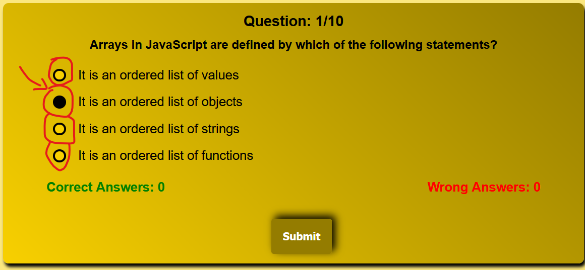

# Javscript Quiz App - Javascript Project: Milestone 2

Javscript Quiz is an interactive quiz for users to answer questions on their knowledge of Javascript. 
Questions created are stored in a separate Array. 

The Quiz randomly picks 10 of those questions to be answered.

The color palette is harmoniously coordinated with the logo, allowing for a coherent and calm image with its bright and warm colors.

## Live project

The live project can be viewed here under this link **[FinalProject](https://werner-staeblein.github.io/Project-2/)**

# User Experience (UX)

## User stories

### As a first time user

- As a first time website visitor I want to receive instructions what the quiz is about
- I want to easily and intuitively navigate through the quiz
- I want to know where to start the quiz indicated by a start button
- I want to see my score at the end of the quiz
- I want want to know the number of questions already answered (progress indication/bar)
- I want to restart the quiz either while I am taking the quiz or at the end of the quiz (user control)
- I want to see different questions each time that I am running the quiz for the app to be more entertaining
- I want to see the correct answers for those quiz questions answered incorrectly

### As a returning user

- I want to answer different questions so that I do not see the same questions again
- I want to play the game as many times that I would want to

# Structure

The website provides instructions for the quiz on the opening page and allows user to press the button "Start JS Quiz" for the quiz.

Once the quiz is started with start button, the user receives a sequence of ten questions related to Javscript. 

The 10 questions are randomly drawn from a catalogue of quiz questions to ensure that each quiz round provides different set of questions.

Once the quiz is completed with 10 questions answered, the user is automatically shown the results page including the score of correct answers.

The user has the option to either

- (i) see the correct answers for those questions where the user incorrectly answered a quiz question or 
- (ii) restart the quiz 

If user decides to see the correct answers for quiz questions answered incorrectly, the user still maintains the option to restart the quiz again. 

Regardless of the user option to restart the quiz at the end of the quiz with the retry-Button, the user can always start a new quiz round by clicking on the JS logo.

After opening a quiz with the start button, the user can decide to restart the quiz by clicking on the logo on the top left of the website. This will take the user back to the start of the quiz. 

User does not have to finish a quiz round to be able to start a new quiz round. There is no score, however,  shown when user starts a new quiz round while the round was not completed with 10 questions answered. 

Interim scores for discontinued quiz rounds are not stored.

### Opening Page | Instructions page

The opening page provides a logo, clear headline what the page is about "Javscript Quiz", and instructions for the user to play the quiz combined with the start button for the quiz

### Quiz Page

The quiz page continues to show the logo and title of the website. Once the start button was clicked, the instructions page is no longer visible and is now replaced with the quiz question box. 

The radio buttons for the questions provide options to the user to click one possible answer. Radio buttons are custom-styled to support overall design and appearance of question section.

Once the user submits a choice on the radio button, the next quiz question automatically appears
(automatic user feedback).

 
### Results Page

The results page is an extension of the quiz page.

After finishing 10 quiz questions, the user is provided the score of the quiz with optionality to view correct answers to questions answered incorrectly and to restart the quiz again.

# Design

Design was based on the key colors in the Javascript logo. Using the colors included in the JS logo, a color palette was generated with coolors. This ensures conistent feel for user.

User activity such as buttons highlighted with box-shadows to make overall design more appealing.

A linear gradient using the color scheme was used for the background of the quiz. Different linear gradient used for the quiz box to ensure appealing color design aligned to the base color scheme of the Javascript logo.

### Color Palette

The color palette was created with: **[coolors](https://www.color-hex.com)**

### Typography

Standard fonts available were used with Arial, Helvetica for reasons of legibility. As a backup to these two font-types/font-family, a sans-serif backup font was used.

### Images

The Javascript icon was downloaded from **[Icons8.com](https://icons8.com/icons/set/javascript)**

# Features

### The logo

The logo is shown on all pages of the website. The logo likewise is a hpyerlink to restart the quiz if the user either wants to restart a quiz while having started a quiz or once a quiz round is completed and the user decides to play another quiz round (user control)

On hover, a tooltip is display with information that the quiz can be restarted with click on the logo.

### Start Page quiz instructions page

On the start page the instructions for the quiz are provided. 

The user is informed that questions are  randomly drawn from a set of questions.
The button named start is prominently placed so that user can easily navigate to the start of the quiz.

### Quiz Questions

Quiz section are 10 questions for the user to answer. While answering the questions, the user can see the progress on the number of questions answered. 

Every questions has four radio buttons to choose from. A user can change the radio button/answer for as long as the submit button is not clicked.

Once clicked, the user will automatically move forward to the next quiz question until question no. 10 is reached. While answering the quiz questions, the user is not provided feedback on the correctness of the answers clicked. The incorect answers are displayed at the end of the quiz including a solution to the correct answer.

### Visual Effects

- Change in background color on :hover on the start button

### Customized radio buttons for answer choices

Radio buttons to select answer were customized in CSS to support overall appeal and coherent color experience while playing
the quiz.

### User feedback on scores achieved

### Results Page

Results page is last question plus information about result achieved.
Final score out of 10 is displayed.

Depending on the score achieved, a message is shown.

- if score is equal to 10, user is shown "Seems you are a Javascript wizard"
- if score is higher than or equal to 8 but less than 10, user is shown "Nearing the gold medal"
- if score is higher than or equal to 6 but less than 8, user is shown "Good knowledge but more is yet to come"
- if score is lower than 6, user is shown "Try again to improve your score"

Results also provides option for user to start new quiz. This will take the user to the beginning of the website with a quiz again starting at the first question.

### Show Answer
Once the ShowAnswer button in the results page is clicked, the user is shown the incorrect answers
including the underlying question, the user's answer in the quiz and the correct answer to the 
question. 

As questions are drawn randomly from a auiz array, the user may not face the same question again in
the next quiz round but user can learn from the questions answered incorrectly.

# Technologies

- Languages: HTML, CSS, JavaScript

- **[Favicon.cc](https://www.favicon.cc/)** - Used to prepare the website's favicon

- **[GitHub](https://www.github.com)** - GitHub for storage of files

- **[GitPod](https://www.gitpod.io/)** - GitPod as IDE for development of this site

- **[Git](https://git-scm.com)** - Version control system Git

- **[W3C HTML Markup Validator](https://validator.w3.org/)** - W3C HTML markup validator for validation of HTML code

- **[W3C Jigsaw CSS Validator](https://jigsaw.w3.org/css-validator/)** - W3C Jigsaw CSS validator for validation of CSS code

- **[Javascript Validator](https://beautifytools.com/javascript-validator.php)** to validate the Javscript code.

- **[Visual Code Studios](https://code.visualstudio.com/)** - IDE used to draft the webiste and make working progress remarks in the README.md including placehoders to check for final polishing

- **[Google Chrome Dev Tools](https://developers.google.com/web/tools/chrome-devtools)**- To check responsiveness of page, debug code, and important lighthouse checks for performance, accessibility, best practices, SEO

- **[Techsini](https://techsini.com/multi-mockup/index.php)** - to generate multi-device image with different screen-sizes and devices possibly used by user

- **[www.color-hex.com](https://www.color-hex.com)** - to generate the color palette for the site

- A template provided by Code Institute for the workspace of the project

# Testing

Testing was done incrementally with every change in functionality of code (Javascript) using console.log.
Only once there were no error messages shown, the development process continued and thus resolving issues along the development process.

Only once the manual functionality testing was completed, the visual testing started with additions of CSS.

**Issues resolved**

- ./questions.js not loaded into quiz.js with error message "does not provide export named 'default'. Solution via Stackoverflow search. Found out that 'export default' in questions.js is needed for question.js to be IMPORTED into quiz.js
- in the manual responsiveness testing, font-sizes were adapted

### 1. Feature Testing

Features of the site were tested manually in several test runs to ensure that sie performs intended functionality on all of the key features.

| Feature                   | Test Case                                 | Outcome |
| -----------               | ----------------------------              | -----------------                         |
| Logo                      | click of logo                             | restarts the quiz                         |
| Logo                      | hover over logo                           | display info to                           |
| Start Quiz button         | click of start button                     | starts the quiz                           |
| progress bar              | click through quiz                        | progress bar counts correctly             |
| customized radio button   | click button                              | button takes inteneded color shade        |
| submit question button    | click of button                           | automatically forwards to next question   |
| user feedback scores      | click through quiz numerous times         | correct user feedback shown               |
| retry button              | click of retry button                     | starts a new quiz round                   |
| show answers button       | click show answers button                 | displays answers answered incorrectly     |

### 2. Browser Compatibility

Primary browsers that the audience commonly uses were used to test functionality and visual consistency (layout, design, consistent
display of content)

|    Browser test    |  Intended appearance  |  Intended responsiveness  |
| :----------------: | :--------------------: | :------------------------: |
|       Chrome       |          Good          |            Good            |
|        Edge        |          Good          |            Good            |
|       Firefox      |          Good          |            Good            |

### 3. Responsiveness

|    Device tested                  |  vw-width                 |  Rendered as expected      |
| :----------------:                | :--------------------:    | :------------------------: |
|       iPhone 5SE                  |          320px            |            Good            |
|       Samsung Galaxy 8+           |          360px            |            Good            |
|       Samsung Galaxy S20 Ulrtra   |          412px            |            Good            |
|       iPaid Mini                  |          768px            |            Good            |
|       IPadAir                     |          820px            |            Good            |
|      iPad Pro                     |         1.024px           |            Good            |

### 4. Accessibility

- alternative text/labels used to enable screen readers providing information
- contrasting used to have best possible visibility for the user
- Accessibility for visually impaired (color blindness) was tested with Google Lighthouse

### Automated Testing (Code Validation and Lighthouse testing)

1. **[W3 Markup Validation](https://validator.w3.org/) - HTML Validation**

The website was tested with HTML validator. No error messages

a picture of the validation of the HTML done

<!--  -->

2. **[W3 Jigsaw](https://jigsaw.w3.org/css-validator/) - CSS Validation**

The CSS stylesheet was tested with CSS validator. No error messages or syntactical errors.

A picture of the validation of the CSS done

<!--  -->

3. **[Beautifytools](https://beautifytools.com/javascript-validator.php) - Javascript validation**

The website was tested with JS valiator beautifytools. No error messages or syntactical errors.

A picture of the JS validation done

<!--  -->

4. **[Google Lighthouse](https://developers.google.com/web/tools/lighthouse)**

Final lighthouse scores in table

**lighthouse test desktop (scores reported by lighthouse)**

| File                |  Perf.  | Access. | Best P. | SEO     |
|---------------------|---------|---------|---------|---------|
| index.html          |      |      |      |      |

**lighthouse test mobile (scores reported by lighthouse)**

| File                |  Perf.  | Access. | Best P. | SEO     |
|---------------------|---------|---------|---------|---------|
| index.html          |      |      |      |      |

Include two pictures of lighthouse testing for mobile and desktop

<!--  -->
<!--  -->

# Deployment

This project is deployed to GitHub pages. The deployment steps are as follows:

1. Log in to Github und www.github.com
2. Find repository of this project named (Werner-Staeblein/Project-2)
3. In the headings of the repository find "settings". The settings are on outer right hand side next to "insight" and "security" in the repository sub-heading. Click "settings" here 
4. In settings, a navigation on the left-hand side is shown. This navigation has the first heading "General". In this column that starts with "General" and undder "code and automation" click the link named "Pages". This link named "Pages" is directly on top of the submenu "Security". What matters here is that "Pages" is clicked.
5. You will now see a heading named "GitHub Pages". In the GitHub Pages, go to "build and deployment". In the heading "Branch" choose the options "main" and "/root"
6. Click Save
7. The project from the GitHub site will be deployed at the URL displayed under "Deployments". This heading "Deployments" can be found on the starting page of the GitHub Project. This starting page of the GitHub project can be found here

The link to the project is 
**[FinalProject](https://werner-staeblein.github.io/Project-2/)**

# Credits

### Logic of the quizz app

I used a guide to create to quiz app written by Faraz **[Step-by-step-guide-for-quiz-app](https://www.codewithfaraz.com/content/161/build-a-quiz-application-with-html-css-and-javascript-step-by-step-guide#javascript-code)**

For the logic of the quiz and interactivity coding with Javascript, I likewise used the book "Programmieren Lernen mit Javascript" authored by Stephan Elter

For the randomized shuffling of questions.js array the Fisher-Yates from this source was used **[Stackoverflow Fisher-Yates Randomization](
https://stackoverflow.com/questions/2450954/how-to-randomize-shuffle-a-javascript-array)**

### Javascript quiz questions

The questions for the question.js that serves as the pool for random drawing of questions were partly taken from **[Sanfoundry](https://www.sanfoundry.com/1000-javascript-questions-answers/)** and **[Laurence Svekis](https://basescripts.com/110-javascript-quiz-questions-with-solutions-pdf-download-test-your-knowledge
)**

### Custom radio buttons

I used the blog of Stephanie Eckles **[Custom radio buttons](https://moderncss.dev/pure-css-custom-styled-radio-buttons/)** to make custom style of the radio buttons

# Content

The content for this website has been written by Werner Stäblein and the authors mentioned above in credits for the Javscript questions.

Readme.md file follows the structure of Readme.md provided by Code Institute **[Code Institute readme template](https://github.com/Code-Institute-Solutions/readme-template)**. I also reviewed a variety of different Readme.md prepared and included in the respective GitHub profiles of Code Institute students. I tried to pick the best of all ideas and suggestions.

# Acknowledgements